# Better Recipes

Adds a bunch of recipes to minecraft

Recipes

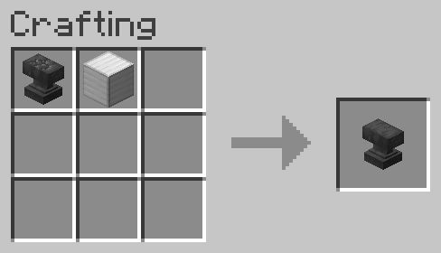

---

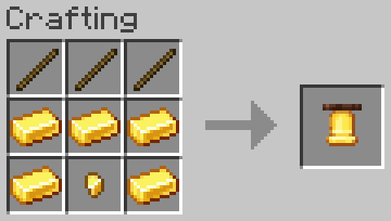

---

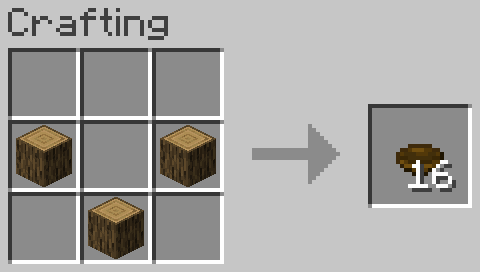

---

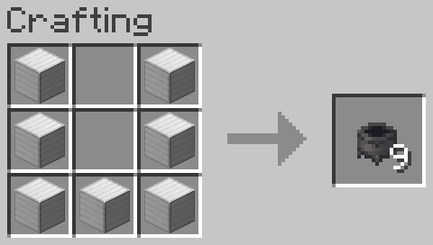

---

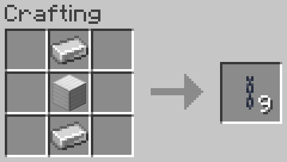

---

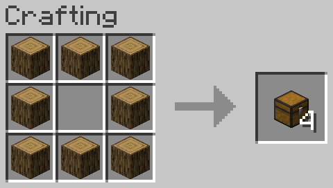

---

---

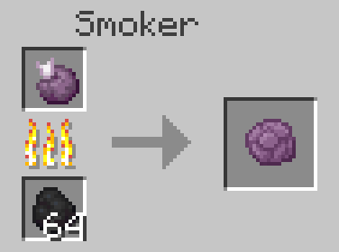

---

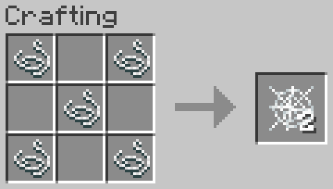

---

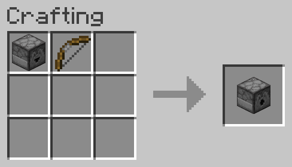

---

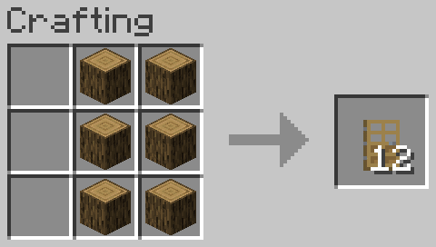

---

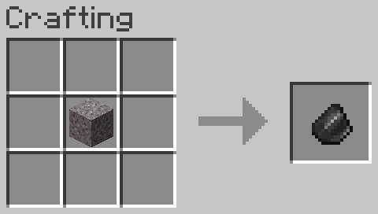

---

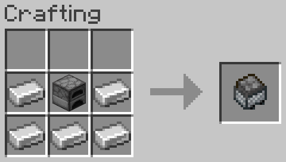

---

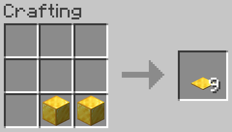

---

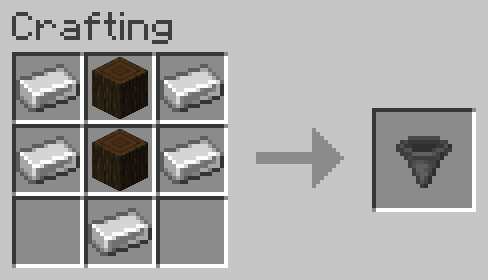

---

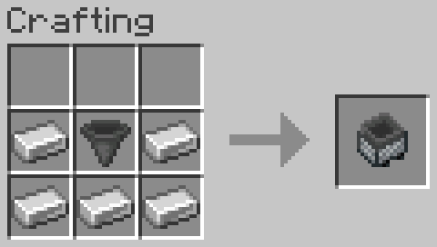

---

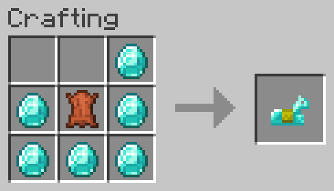

---

---

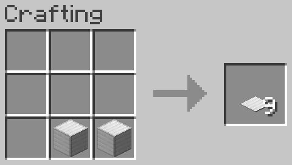

---

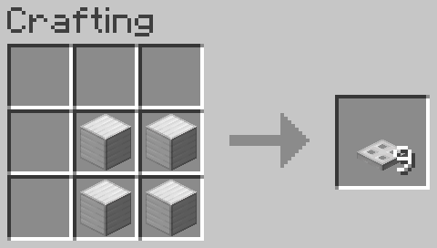

---

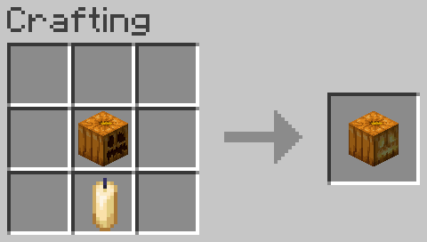

---

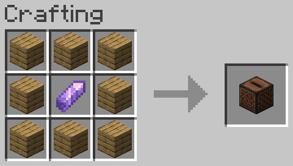

---

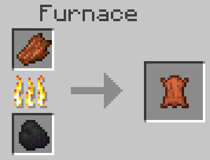

---

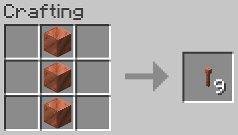

---

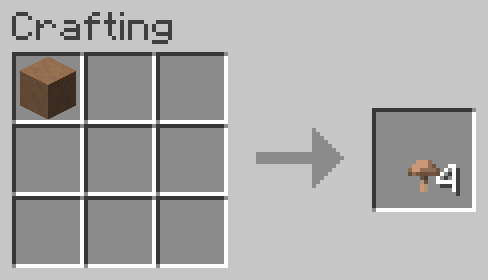

---

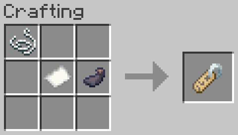

---

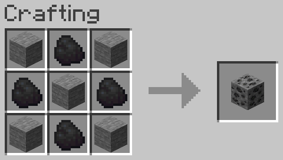

---

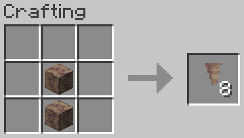

---

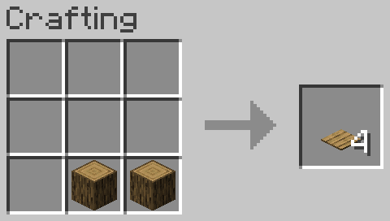

---

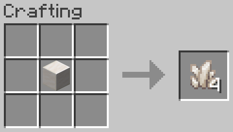

---

---

---

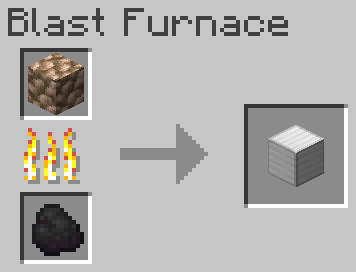

---

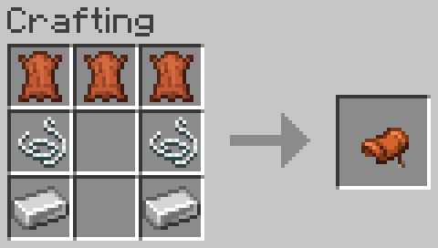

---

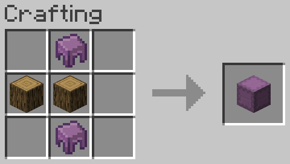

---

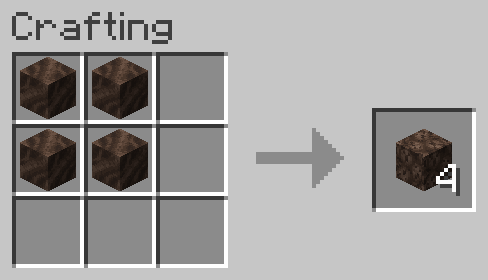

---

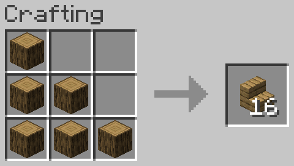

---

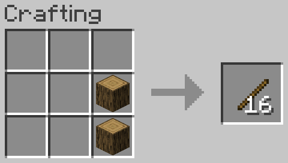

---

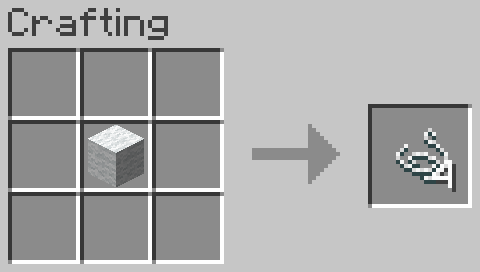

---

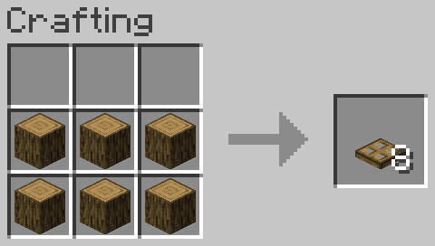

---

nj
