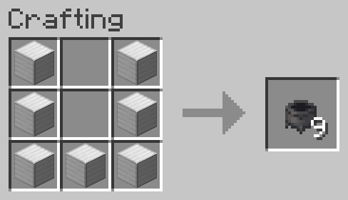
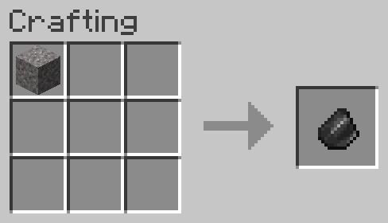
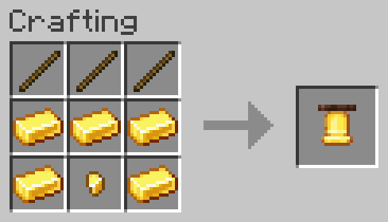
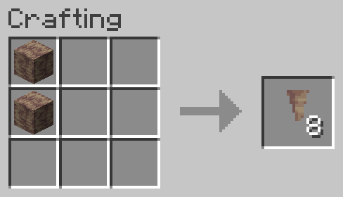
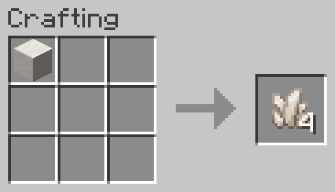
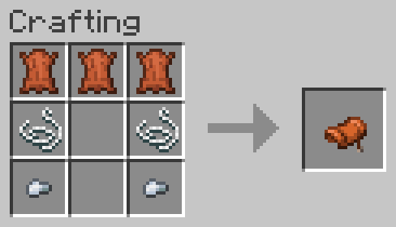

# Better Recipes

Adds a bunch of recipes to minecraft

Bulk Crafting Recipes

## Bowls

## Cauldrons

## Chains

## Chests

## Wooden Doors

## Wooden Trapdoors

## Wooden Stairs

## Wooden Slabs

## Wooden Pressure Plates

## Gold Pressure Plates

## Iron Pressure Plates

## Iron Doors

## Iron Trapdoors

## Lightning Rods

## Sticks

Faster Crafting Recipes

# Faster Crafting Recipes

These are recipes that are primarily meant for ease-of-use.

## Chest Minecart

## Furnace Minecart

## Hopper Minecart

## Dispenser

## Flint

## Hopper

## Jack o' Lantern

## Trapped Chests

Feature Recipes

# Feature Recipes

These are recipes that are meant to add new features to the game, through giving crafts to previously uncraftable items.

## Anvil Repair

Allows for the repairing of anvils.

- Chipped Anvil + 1 iron block -> Anvil
- Cracked Anvil + 1 Iron Block -> Chipped Anvil
- Cracked Anvil + 2 Iron Blocks -> Anvil

## Bell

## Chorus Fruit Smelting

Additionally, chorus fruit can be placed on a campfire.

## Cobwebs

## Horse Armor

## Jukebox

Allows for creating a jukebox from amethyst instead of diamonds.

## Smelting Rotten Flesh to Leather

## Craftable Mushroom Blocks

## Name Tags

## Ores

All ore recipes have been balanced so the returns from breaking it with fortune 3 will be less than the cost of the recipe.

## Pointed Dripstone

## Decompress Quartz

Allows you to store your quartz in block form, and still use the item for redstone recipes.

## Smelting Raw Copper Blocks

## Smelting Raw Gold Blocks

## Smelting Raw Iron Blocks

## Saddle

## Shulkerbox

Allows you to craft a shulker box without first crafting a chest.

## Soul Sand & Soul Soil conversion

Allows converting soul sand to soul soil and vice-versa.
This makes soul soil renewable, as soul sand already is from bartering.

## Wool to String Conversion

Makes it easier to gather and store large amounts of string.

