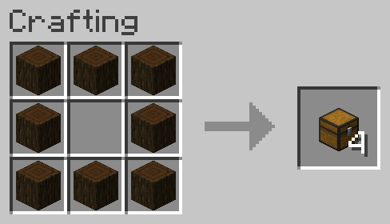
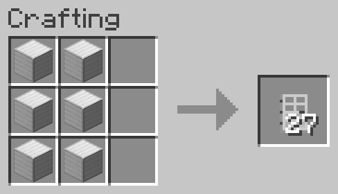
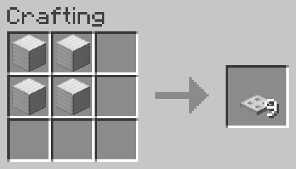
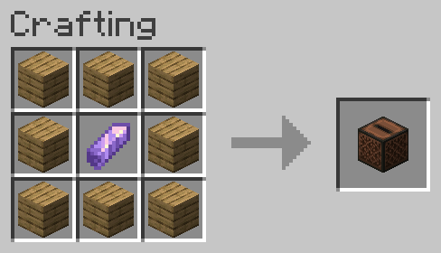

# Better Recipes

Adds a bunch of recipes to minecraft

Recipes

---

---

---

---

---

---

---

---

---

---

---

---

---

---

---

---

---

---

---

---

---

---

---

---

---

---

---

---

---

---

---

---

---

---

---

---

---

---

---

---

nj
